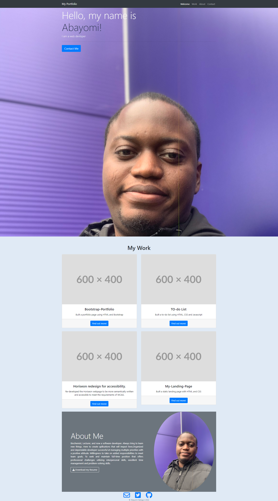

# Bootstrap-Portfolio
In this project, I built my portfolio layout using the Bootstrap CSS framework.

The site has a navigation menu at the top, a hero section, work section and an About Me section.

##Screenshot

### Deployed Link
Link to the deployed [apllication](https://abayomi2010.github.io/Bootstrap-Portfolio/)

### Link to repository
[Bootstrap portfolio](https://github.com/abayomi2010/Bootstrap-Portfolio)